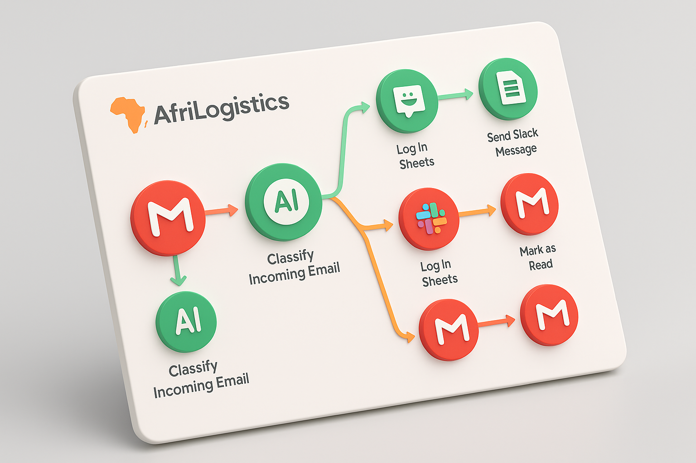

# Overview

https://github.com/user-attachments/assets/55e1c0d8-ee4d-487b-acda-71ef0ff31238

This project is a workflow built with [Make.com](http://make.com/) that automatically **sorts incoming emails, performs category-specific actions, and marks them as read**.

To illustrate a real-world use case, I’ve framed it as a case study for a fictitious logistics company called **AfriLogistics**, a small business in the **Logistics & Supply Chain** sector.

## Email Assistant - Case Study

### Real-World Company: **AfriLogistics Togo**

**Sector:** Logistics & Supply Chain

**Team Size:** 20 employees

**Volume of Emails Daily:** 150+ emails from clients, partners, customs, and suppliers

### Pain Points

- Manual sorting of emails consumes 3–4 hours daily.
- Important emails (like customs clearance updates) often get lost in inbox noise.
- Delayed responses lead to shipment delays and client dissatisfaction.
- No centralized tracking system for client requests.

### Benefits

- Instantly classifies and prioritizes emails.
- Drafts quick responses or routes to appropriate team members.
- Keeps a live log of customer inquiries by status (Pending, Answered, Escalated).
- Reduces human effort by 70%, avoids lost messages, and improves SLA.

In this context, we’ve identified the following categories and actions:

### Email Categories

The table below contains categories with desription and actions triggered.

| **Category** | **Description** | **Automated Actions** |
| --- | --- | --- |
| **Shipment Updates** | Tracking info, delays, dispatch confirmations | Move to folder → AI-crafted Slack alert → Log in Google Sheets → Mark as read |
| **Client Requests** | ETA requests, service queries, complaints | Move to folder → AI-crafted Slack alert → Log in Google Sheets → Mark as read |
| **Invoices & Payments** | Payment confirmations, invoice submissions, reminders | Move to folder → Forward to Finance → Log in Google Sheets → Mark as read |
| **Partnership & Sales** | New service offers, supplier relations, RFPs | Move to folder → Mark as read |
| **Marketing & Newsletters** | Subscriptions, campaigns, promotional emails | Move to folder → Mark as read |
| **Read Later** | Emails that don't match any of the above categories | Move to folder → Mark as read |

### Automation Solution

**Email Assistant Bot** built with:

- **Gmail**
- **Make.com**
- **Slack**
- **Gemini AI**
- **Google Sheets**

### Why these tools ?

- **Gmail (Email Provider)**
    
    One of the most widely used email services globally.
    
- **Make.com (Workflow Builder)**
    
    I chose Make.com over n8n because it’s easier to set up and fully usable for free, great for client delivery. However, n8n remains a strong alternative, especially with its native **Text Classifier node**, which could improve email categorization accuracy.
    
- **Slack (Communication App)**
    
    A popular internal communication platform, ideal for instantly notifying the right teams or individuals.
    
- **Gemini (AI Tool)**
    
    Fast, versatile, and free—Gemini includes useful features like text generation, image creation, and audio-to-text conversion. It's also quicker to use than tools behind OpenRouter.
    
- **Google Sheets (Database)**
    
    A flexible and widely used option for logging data in no-code workflows. Easier to integrate than Airtable or Notion and natively works well with Gmail.
    

### Flowchart

You can see the flowchart [**here**](https://excalidraw.com/#json=28getxtJkDem7np_0TT3d,Ks7l9-WCtEgkjehx1OIoUQ).

In case the link doesn’t work you can download the flowchart and open it in [**excalidraw.com**](http://excalidraw.com/)

### Google sheets Database

